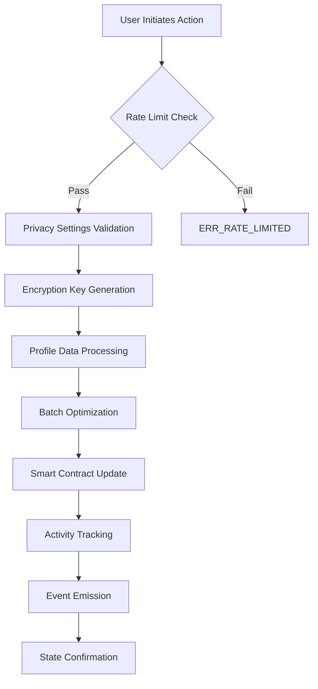
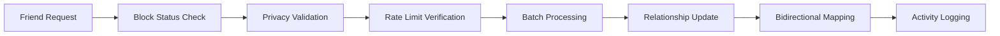

# BitSphere

## Sovereign Social Protocol on Stacks Layer 2

[](https://bitcoin.org)
[](https://stacks.co)
[](https://clarity-lang.org)

BitSphere is a next-generation decentralized social networking protocol engineered for Bitcoin's security model with Stacks Layer 2 efficiency. Built on a zero-trust architecture, BitSphere empowers users with complete sovereignty over their social graph while maintaining enterprise-grade privacy and scalability.

## 🎯 Core Features

- **🔐 Cryptographic Privacy Engine** - Zero-knowledge architecture with client-side encryption
- **⚡ Adaptive Batch Processing** - Dynamic L2 transaction optimization
- **🛡️ Bitcoin-Native Identity** - Self-sovereign identity anchored to Bitcoin addresses
- **🤖 Intelligent Rate Limiting** - AI-driven abuse prevention with seamless UX
- **🔒 Granular Access Controls** - Fine-tuned privacy settings for every interaction
- **🌐 Censorship Resistance** - Immutable social graph on Bitcoin's backbone

## 🏗️ System Architecture

### High-Level Architecture

```
┌─────────────────────────────────────────────────────────────┐
│                    BitSphere Protocol                        │
├─────────────────────────────────────────────────────────────┤
│  Frontend Layer                                             │
│  ┌─────────────────┐  ┌─────────────────┐  ┌──────────────┐ │
│  │   Web Client    │  │  Mobile Client  │  │  Desktop App │ │
│  └─────────────────┘  └─────────────────┘  └──────────────┘ │
├─────────────────────────────────────────────────────────────┤
│  Protocol Layer                                             │
│  ┌─────────────────┐  ┌─────────────────┐  ┌──────────────┐ │
│  │ Privacy Engine  │  │ Batch Processor │  │ Rate Limiter │ │
│  └─────────────────┘  └─────────────────┘  └──────────────┘ │
├─────────────────────────────────────────────────────────────┤
│  Smart Contract Layer (Clarity)                             │
│  ┌─────────────────┐  ┌─────────────────┐  ┌──────────────┐ │
│  │ User Management │  │ Social Graph    │  │  Access      │ │
│  │    & Privacy    │  │   & Batching    │  │  Control     │ │
│  └─────────────────┘  └─────────────────┘  └──────────────┘ │
├─────────────────────────────────────────────────────────────┤
│  Stacks Layer 2                                             │
│  ┌─────────────────┐  ┌─────────────────┐  ┌──────────────┐ │
│  │ Transaction     │  │ State           │  │ Consensus    │ │
│  │ Processing      │  │ Management      │  │ (PoX)        │ │
│  └─────────────────┘  └─────────────────┘  └──────────────┘ │
├─────────────────────────────────────────────────────────────┤
│  Bitcoin Settlement Layer                                   │
│  ┌─────────────────────────────────────────────────────────┐ │
│  │              Bitcoin Blockchain                         │ │
│  │         (Final Settlement & Security)                   │ │
│  └─────────────────────────────────────────────────────────┘ │
└─────────────────────────────────────────────────────────────┘
```

### Component Interaction Flow

```
User Action → Privacy Engine → Rate Limiter → Batch Processor → Smart Contract → Stacks L2 → Bitcoin
     ↑                                                                                          │
     └──────────────────── Confirmation & State Update ←────────────────────────────────────────┘
```

## 🔧 Contract Architecture

### Core Data Structures

| Map Name | Purpose | Key Components |
|----------|---------|----------------|
| `Users` | Primary user registry | Identity, status, encryption keys |
| `UserPrivacy` | Privacy control matrix | Granular visibility settings |
| `RateLimits` | Anti-abuse system | Action counters, reset cycles |
| `UserBatches` | L2 optimization engine | Batch sizing, processing metrics |
| `UserActivity` | Engagement analytics | Login tracking, usage patterns |
| `Friendships` | Social graph registry | Bidirectional relationships |
| `BlockedUsers` | Access control system | Harassment prevention |

### Privacy-First Design

```
┌─────────────────────────────────────────────────────────────┐
│                 Privacy Control Matrix                      │
├─────────────────────────────────────────────────────────────┤
│                                                             │
│  User Data         Visibility Control    Encryption         │
│  ┌─────────────┐   ┌─────────────────┐   ┌──────────────┐    │
│  │ Profile     │──→│ friend-list     │──→│ Client-Side  │    │
│  │ Social Graph│──→│ status-visible  │──→│ E2E Keys     │    │
│  │ Activity    │──→│ metadata        │──→│ Optional     │    │
│  │ Metadata    │──→│ last-seen       │──→│ Key Rotation │    │
│  └─────────────┘   └─────────────────┘   └──────────────┘    │
│                                                             │
└─────────────────────────────────────────────────────────────┘
```

## 📊 Data Flow Architecture

### User Registration & Profile Management



### Social Graph Operations



### Batch Processing Optimization

```
┌─────────────────────────────────────────────────────────────┐
│              Adaptive Batch Processing                      │
├─────────────────────────────────────────────────────────────┤
│                                                             │
│  Input Stream     Batch Engine      L2 Optimization        │
│  ┌─────────────┐  ┌─────────────┐   ┌──────────────┐        │
│  │ User Actions│  │ Size        │   │ Gas          │        │
│  │ ┌─────────┐ │  │ Calculation │   │ Optimization │        │
│  │ │Action 1 │ │  │             │   │              │        │
│  │ │Action 2 │ │──→│ MIN: 10     │──→│ Batch        │        │
│  │ │Action 3 │ │  │ MAX: 100    │   │ Submission   │        │
│  │ │   ...   │ │  │ AUTO: AI    │   │              │        │
│  │ └─────────┘ │  │ Sizing      │   │              │        │
│  └─────────────┘  └─────────────┘   └──────────────┘        │
│                                                             │
└─────────────────────────────────────────────────────────────┘
```

## 🚀 Getting Started

### Prerequisites

- Stacks CLI (`npm install -g @stacks/cli`)
- Clarinet (`cargo install clarinet`)
- Node.js 16+ for frontend integration

### Deployment

```bash
# Clone the repository
git clone https://github.com/grace-umanah/bitsphere.git
cd bitsphere

# Test the contract
clarinet test

# Deploy to testnet
clarinet deploy --testnet

# Deploy to mainnet
clarinet deploy --mainnet
```

### Integration Example

```javascript
import { StacksTestnet } from '@stacks/network';
import { callReadOnlyFunction, makeContractCall } from '@stacks/transactions';

// Update user privacy settings
const updatePrivacy = await makeContractCall({
  contractAddress: 'SP...',
  contractName: 'bitsphere',
  functionName: 'update-advanced-privacy-settings',
  functionArgs: [
    boolCV(true),  // friend-list-visible
    boolCV(false), // status-visible
    boolCV(true),  // metadata-visible
    boolCV(false), // last-seen-visible
    boolCV(true),  // profile-image-visible
    boolCV(true)   // encryption-enabled
  ],
  senderKey: privateKey,
  network: new StacksTestnet()
});
```

## 🛡️ Security Model

### Multi-Layer Security Architecture

1. **Bitcoin Settlement Layer** - Immutable finality through Proof of Transfer
2. **Smart Contract Validation** - Comprehensive input validation and access controls
3. **Client-Side Encryption** - Zero-knowledge privacy with optional key rotation
4. **Rate Limiting Engine** - Multi-tier abuse prevention with adaptive thresholds
5. **Privacy Controls** - Granular permissions for all data exposure

### Threat Mitigation

| Threat Vector | Mitigation Strategy |
|---------------|-------------------|
| Spam/DoS | Intelligent rate limiting with 24hr reset cycles |
| Privacy Breach | Client-side encryption + granular visibility controls |
| Social Engineering | Multi-signature validation + time-locked operations |
| Data Mining | Optional metadata encryption + privacy-first defaults |
| Censorship | Immutable storage on Bitcoin via Stacks Layer 2 |

## 📈 Performance Metrics

- **Transaction Throughput**: 10-100 operations per batch
- **Rate Limiting**: 100 daily actions, 20 friend requests, 24 status updates
- **Batch Optimization**: Adaptive sizing (10-100 range) with 1-hour expiry
- **Privacy Controls**: 6 granular settings with real-time updates
- **Settlement Time**: Bitcoin block confirmation (≈10 minutes final settlement)

## 🤝 Contributing

We welcome contributions! Please see our [Contributing Guidelines](CONTRIBUTING.md) for details.

1. Fork the repository
2. Create a feature branch (`git checkout -b feature/amazing-feature`)
3. Run tests (`clarinet test`)
4. Commit changes (`git commit -m 'Add amazing feature'`)
5. Push to branch (`git push origin feature/amazing-feature`)
6. Open a Pull Request

## 📄 License

This project is licensed under the MIT License - see the [LICENSE](LICENSE) file for details.

## 🌟 Roadmap

- [ ] Mainnet deployment and security audits
- [ ] Mobile SDK and developer tools
- [ ] Advanced encryption features and key rotation
- [ ] Cross-chain interoperability and scaling solutions
